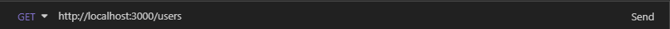
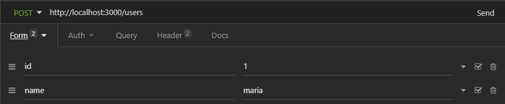
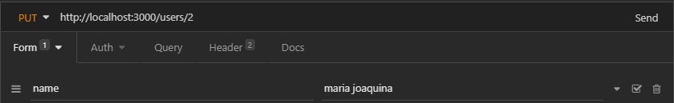
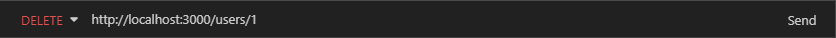

<h1 align="center">Basic Node REST</h1>

<p align="center">Estudo sobre REST utilizando o Express do Node.js</p>

### 🛠 Tecnologias

As seguintes ferramentas foram usadas na construção do projeto:

- [Node.js](https://nodejs.org/en/)

### Pré-requisitos

Antes de começar, você vai precisar ter instalado em sua máquina as seguintes ferramentas:
[Git](https://git-scm.com), [Node.js](https://nodejs.org/en/). 
Além disto é bom ter um editor para trabalhar com o código como [VSCode](https://code.visualstudio.com/)

### 🎲 Rodando o Back End (servidor)

```bash
# Clone este repositório
$ git clone https://github.com/Toggy81/api-node-express.git

# Acesse a pasta do projeto no terminal/cmd
$ cd api-node-express

# Instale as dependências
$ npm install

# Execute a aplicação em modo de desenvolvimento
$ node index.js

# O servidor inciará na porta:3000 - acesse <http://localhost:3000>
```
Utilize as seguintes requisições no seu software de preferência. Para este exemplo utilizamos o [Insomnia](https://insomnia.rest/download):

- Para listar usuários


- Para inserir usuários


- Para atualizar os dados de um usuário


- Para deletar um usuário


### Autor
---

<a href="https://toggy81.github.io/personal-page/">
 
 <br />
 <sub><b>Ricardo Montes</b></sub></a>


Feito com ❤️ por Ricardo Montes 👋🏽 Entre em contato!

[](https://www.linkedin.com/in/Toggy81/) 
[](mailto:tognolamontes@yahoo.com.br)
